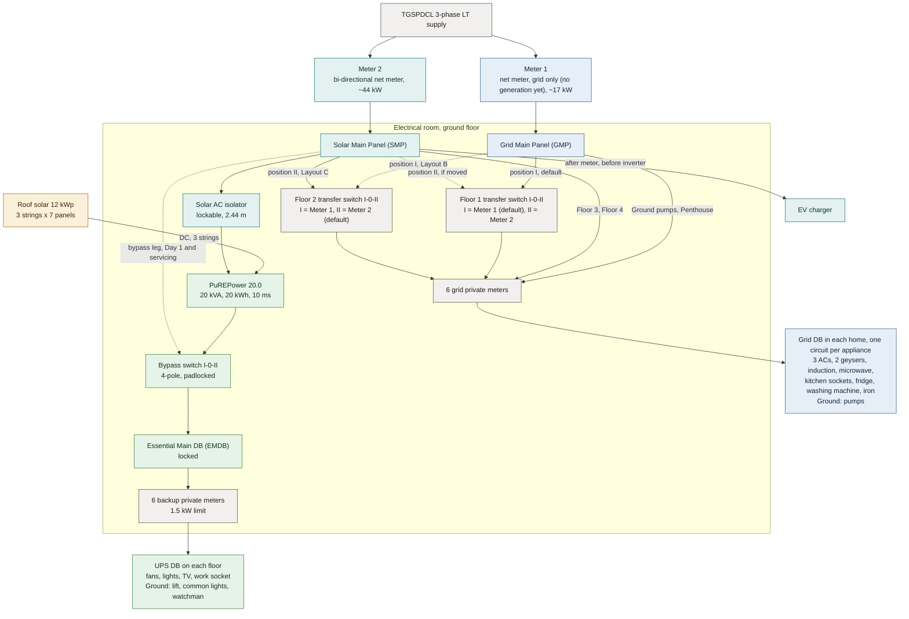
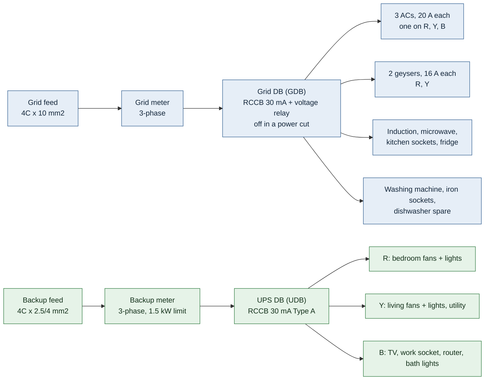
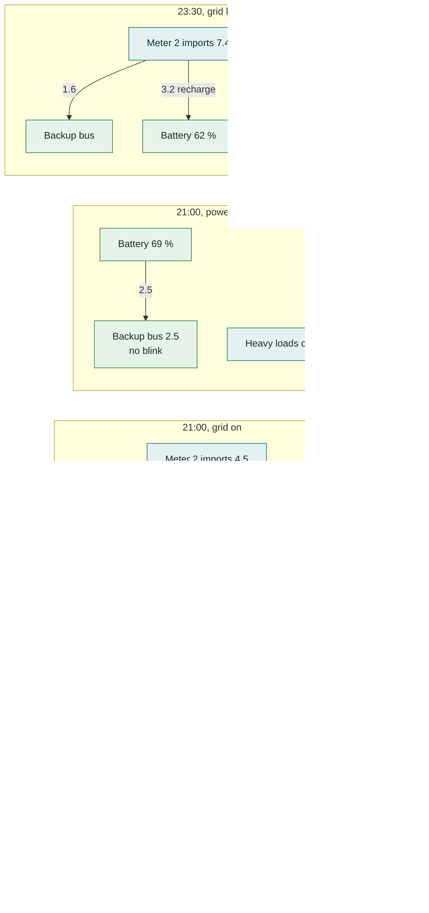

# Solar + Backup Power - Final Plan

G+4 + penthouse, Hyderabad. 7 Oct 2026. Built from your decisions in
[solar_power_plan_decision_guide.md](solar_power_plan_decision_guide.md), then tightened
after the design review: inverter ceiling 17.5 kW, charger before the inverter, pumps on
Meter 2, 14 kWp.

- **Interactive version:** open [index.html](index.html) in any browser (works offline).
  It has the building layout, wiring diagram, a 24-hour energy-flow simulator, phase-balance and
  bill calculators, and printable sheets for the electrician and contractor.
- **Numbers** come from one model, [js/model.js](js/model.js), so this file and the
  website always agree. They are estimates; anything marked **VERIFY** needs a written answer
  before you pay.

---

## 0. Words used

Full list: section 0 of the decision guide. New short forms in this plan:

| Short form | Full form | Plain meaning |
|---|---|---|
| Layout A / B / C | Meter split options | Which floors' heavy loads sit on Meter 2 (section 2.1) |
| PB1 / PB2 | Phase plan 1 / Phase plan 2 | Backup side: one phase per home (PB1) or 3-phase per home (PB2) |
| MA / MB | Metering option A / B | One dual-channel meter per floor (MA) or two separate meters per floor (MB) |
| GMP / SMP | Grid Main Panel / Solar Main Panel | Boards after TGSPDCL Meter 1 / Meter 2 |
| EMDB | Essential Main Distribution Board | Locked board fed by the inverter |
| GDB / UDB | Grid Distribution Board / UPS Distribution Board | Heavy-load board / backup board on each floor |
| SOC | State of Charge | Battery % |
| RPR | Reverse-Power Relay | Trips when power flows backwards |
| PSR | Phase-Sequence Relay | Stops a 3-phase motor if R-Y-B order is wrong |

---

## 1. Your decisions and how the plan uses them

| Topic | Your choice | In this plan |
|---|---|---|
| TGSPDCL meters | Only 2 | Both are net meters. Meter 1 = net meter, grid only (no generation behind it yet). Meter 2 = net meter + inverter |
| Meter split | Split 2 (balanced), cheaper units per meter, 3-phase balance even with empty floors, no Group Net Metering (GNM) | **Layout C**: Meter 2 carries the inverter + heavy loads of Floors 2, 3, 4, sized against the inverter's confirmed 20 kVA rating. Both meters stay under 800 units every month. No GNM. Floor 1 and Floor 2 each have a transfer switch so the split can move to Layout B, or a third position, without rewiring (2.1) |
| Household appliances | Added once the appliance list was worked out | Air conditioners, geysers, kitchen, fridge, washing machine on each home's grid board, one circuit each; off in a power cut (2.9) |
| Floor wiring | W1 two boards per floor | Grid DB + UPS DB on every floor; no blink |
| Floor metering | Bill grid and solar/backup units; dual-source meter only if it keeps the rails separate, else 2 meters | Both scenarios kept: **MA** (one dual-channel meter) and **MB** (two meters, recommended) |
| Solar size | S3, raised to 14 kWp for the May margin | 14 kWp, 3 strings of 8 half-cut panels. Monthly net metering is the rule (TGERC rooftop regulation, 15 Nov 2025), not an assumption |
| Battery | B1 backup-first | No daily cycling. Summer float near 90 %, not held at 100 % in a hot room |
| Billing | Split the two actual TGSPDCL bills by readings; common split equally by 5 homes; postpaid RS485 | Pooled rate per unit; Ground (common) cost / 5; vacant home's share falls on the owner. Two alternatives shown in 2.6 |
| Inverter location | Ground-floor electrical room | Yes |
| Backup limit per home | 1.5 kW | 1.5 kW (Penthouse 1.0 kW). Backup bus design ceiling 17.5 kW, not the 20 kVA nameplate |
| BLDC fans | Yes | Yes (about 30 % less backup load) |
| Pump on backup | No, but "if the inverter allows" | Borewell pump: never. Sump-to-overhead-tank transfer pump: default no; an interlocked option is costed (2.7) |
| Lift on backup | Yes | Yes, with the protection list in section 11 |
| PMSG subsidy | Try, and show both scenarios | Three cases in 2.4 |
| Car charger | After Meter 2, before the inverter | Solar main panel circuit 7. Units offset by monthly net metering. Not on the backup bus |
| Longest power cut | "Note it in the final plan" | Section 2.5 |
| Extra asks | BoM; lift reverse-current protection | Sections 10.3 and 11 |

---

## 1.1 Rules locked after the review

These override any older line in this file if the two disagree. The website uses the same rules.

| Rule | What it means |
|---|---|
| Inverter ceiling | Backup bus planned to **17.5 kW**, not 20 kVA. Worst case with every home at its limit and the lift running is 14.8 kW. Slack is 2.7 kW. Grid recharge is capped at 2.5 kW so a restart after a cut cannot stack on a full bus. |
| Phases | 3-phase backup in every home. Work-socket phase rotates with the floor. 3 A breaker per phase (2 A in the penthouse), 3 A sockets only, not universal 6/16 A sockets. All 32 empty/occupied combinations stay inside 17.5 kW. The busiest case is everyone home, not a random vacant floor. |
| Charger | Solar main panel circuit 7, after Meter 2, before the inverter. Monthly net metering offsets its units. It is not on the backup bus. A 240-unit charging month in May-July crosses 800 units; keep those months under about 170 units. |
| May balance | 14 kWp and the common pumps on Meter 2 (grid side, not through the inverter). Worst month is then 660 units on Meter 1 (May) and 624 on Meter 2 (June). Both are more than 100 units under the 800-unit fixed-charge cliff. At 12 kWp the two meters sat at 750 and 744. |
| Pump switch | 4-pole 20 A, I-0-II. Position II (Meter 2) is the default. Position I only together with the Floor 2 switch, if TGSPDCL counts every appliance. |
| Floor cut-off | Two 4-pole isolators per floor, one padlock hasp. A single 4-pole switch cannot open both feeders. |
| Bus-tie | 4-pole 160 A breaker, normally open, trapped-key interlock. Not a changeover. 70 mm2 tie, sized for the one-meter expected peak (about 95 A), not for every appliance at once. Close only after TGSPDCL removes the unused meter, phase and neutral. |
| Net metering | The rule, not an assumption. TGERC rooftop regulation in force 15 Nov 2025: import and export net inside the month. Only a month-end surplus is paid, at the lowest discovered solar tariff. ₹2.75 in this plan is the planning figure for that tariff. |

Both bills at this design point: about ₹64,300 a year (Meter 1 ₹36,100, Meter 2 ₹28,200). Surplus about 646 units a year. No month over 800 units. Expected peak about 14 kW and 47 kW. Every appliance counted is about 29 kW and 72 kW, so Layout C still needs the Floor 2 switch if TGSPDCL adds nameplates. Move the pump switch to Meter 1 at the same time, or Meter 2's connected load in Layout B sits on the 56 kW line.

---

## 2. Answers to your questions

### 2.1 "I doubt Meter 2 with the inverter and Meter 1": reworked, meter split reassessed

**What's confirmed about the PuREPower Home 20.0**, checked online against the maker's own
product page and retail listing (Oct 2026) - no independent installation manual is public yet,
so treat this as better than a guess, not as a datasheet:

| Confirmed | Still VERIFY in writing with PuREnergy |
|---|---|
| **20 kVA rated power, 20 kWh lithium battery, 20 kW solar input** (the "20.0" in the name covers all three) | Exact per-phase breaker rating (this plan assumes an even 3-way split, about 6.7 kW/phase, section 5) |
| Built to run a 3-phase residential lift, ACs, geysers, mixers, coolers directly | Whether it switches the neutral in a power cut (N-E link, 9.3) |
| Comms: BMS, dry-contact, CAN, Bluetooth, WiFi, AI cloud | Exact dry-contact signal list and count (11) |
| High-frequency-isolation topology, about 150 kg, wall-mounted | Grid-charge current limit; where the zero-export CT sits |
| 5-year standard + 12-year extended warranty | What the ₹5.5 lakh quote includes; battery chemistry (LFP assumed) |

This plan only ever runs the inverter in **Hybrid mode** - grid, solar and battery live
together. On-grid-only and off-grid-only modes don't apply to this building and aren't discussed
further. Inside Hybrid mode, the priority you asked for - **use the backup loads first, charge
the battery to its target second, sell the rest to TGSPDCL third** - is the standard
"self-consumption priority" setting that this class of hybrid inverter publishes; it is not
special firmware. One thing to get right with PuREnergy: the grid-facing CT/meter feedback loop
that normally forces **zero export** (used on a connection that has no net meter) is not what
you want on Meter 2. **Both Meter 1 and Meter 2 are provisioned as net meters by TGSPDCL**, but
only Meter 2 has generation behind it today - the inverter's one AC input only ever connects
there - so only Meter 2 actually exports; Meter 1 only ever imports because nothing feeds it.
Ask PuREnergy to set Meter 2's loop to allow export once the battery is at its B1 floor (85 %),
not to clamp export to zero. The exact menu names are **VERIFY**; the behaviour described is the
standard hybrid pattern for this class of inverter. If a second inverter is ever added behind
Meter 1 (section 8), the same setting applies there too, since it is already a net meter.

The PuREPower has **one AC input**, so it must sit behind one TGSPDCL meter (Meter 2). That
part can't change. What can change is **which floors' heavy loads (ACs, geysers, kitchen) go on
each meter**. With pooled billing, every floor pays the same rate per unit, so this choice only
changes the **total** of the two bills, not who pays what.

I tested three layouts for a full year (12 kWp, all homes occupied, inverter correctly sized at
**20 kVA**):

| | Layout A: by load type | Layout B: 2 floors on Meter 2 | **Layout C: 3 floors on Meter 2 (recommended starting position)** |
|---|---|---|---|
| Meter 1 carries | Heavy loads of all floors + pumps | Ground pumps, Floors 1, 2, Penthouse | Ground pumps, Floor 1, Penthouse |
| Meter 2 carries | Inverter only | Inverter + Floors 3, 4 | Inverter + Floors 2, 3, 4 |
| Meter 1 units/yr | 14,880 | 8,880 | 5,880 |
| Meter 2 net units/yr | 0 (4,656 sold cheap) | 2,115 (771 sold cheap) | 4,441 (97 sold cheap) |
| Months any meter is over 800 units | 12 | 3 | **0** |
| Months Meter 2 ends in surplus | 12 | 5 | 3 (tiny: 74, 20, 3 units) |
| Expected peak, Meter 1 / Meter 2 | 41 / 20 kW | 25 / 36 kW | 17 / 44 kW |
| Every appliance counted, Meter 1 / Meter 2 | 81.7 (over 56) / 20.0 kW | 48.8 / 52.9 kW | 32.3 / 69.4 kW (over 56) |
| **Both bills per year** | ₹1,48,200 | ₹96,000 | **₹85,900** |
| Same layout without solar | ₹2,76,400 | ₹2,68,000 | ₹2,69,900 |

**Headroom.** Layout C's headroom on expected peak is
12 kW spare (56 - 44 kW) - still comfortable. On a connected-load basis Layout C is 69.4 kW
against the 56 kW limit (24 % over); if TGSPDCL insists on nameplate
sanctioning, the gap to close is real. Layout B's connected-load margin is also
tight: a comfortable 47.9 kW on expected peak narrows to 52.9 kW on connected load - only 3.1 kW of headroom before 56 kW.
None of this changes which layout is best; it does mean the fallback plan below matters.

Why Layout C still wins as the starting position:

- Every solar unit lands on a meter that is still importing, so it cancels a ₹7.70-10 unit
  instead of being sold at about ₹2.75.
- Meter 1 drops to about 490 units/month: lower slabs and the ₹10/kW fixed charge (not ₹50/kW).
- On expected peak both meters are well under the 56 kW Low Tension (LT) limit.

**The slab mechanic behind this (your question).** TGSPDCL's domestic tariff is progressive and
each connection's slab resets from zero every month, so the average rate climbs fast as a
connection's monthly units grow - and that has nothing to do with solar once a meter is left
without any generation behind it to offset it:

| Units on a connection, in a month | Average rate works out to |
|---|---|
| 100 | ₹2.52/unit |
| 200 | ₹4.10/unit |
| 300 | ₹5.97/unit |
| 490 (Meter 1 in Layout C) | ₹7.23/unit |
| 800 (fixed charge jumps to ₹50/kW above this) | ₹8.11/unit |
| 1,200 | ₹8.74/unit |
| 1,700 | ₹9.11/unit |

This is exactly the risk you're flagging: if a meter carries a lot of consumption with no solar
behind it, its units don't just cost a flat rate - they climb this curve, and the fixed charge
jumps too past 800 units. It's why Layout C deliberately keeps Meter 1 down to about 490
units/month (₹7.23/unit average) instead of the roughly 1,240 units/month Layout A would put
there (deep in the ₹50/kW tier, over ₹8.70/unit). Every floor moved off Meter 1 onto the
solar-backed Meter 2 lowers Meter 1's average rate and keeps it off the 800-unit trigger - that's
the real logic behind the layout choice, not just the headline bill total. The single-meter
contingency in 2.10 is the same mechanic applied to the whole building at once.

**Don't lock into one layout - make it adjustable.** With the margin tight and the
TGSPDCL counting rule still open (2.9), this plan fits **two** floor-transfer switches as
standard, not one:

- **Floor 2:** swaps Layout C into Layout B if TGSPDCL counts connected load.
- **Floor 1:** on its own it fixes an empty-floor surplus (below); together with the
  Floor 2 switch it gives a third position (both Floor 1 and Floor 2 on Meter 1) if occupancy or
  the counting rule calls for it later.

Each switch is a padlocked 4-pole I-0-II, break-before-make, about ₹40,000-80,000 each (9.1,
10.3). Moving a switch needs a fresh written request to TGSPDCL every time (**VERIFY** the
approval process and whether a move is billed as a new connection); budget an electrician's
half-day visit per move.

**Empty floors.** If homes on Meter 2 are vacant, Meter 2 can end months in surplus. Example,
Floors 2 and 3 empty: surplus 3,672 units/yr in all 12 months (this figure is unaffected by the
inverter correction - it depends on backup-bus and solar units, not on kW). Flipping the Floor 1
switch to Meter 2 cuts the surplus to 1,537 units in 7 months. Also moving the Penthouse (a
third, optional switch, not standard) cuts it to 927 units in 5 months. Every switch is
break-before-make, so the two meters are never connected.

### 2.2 "Sanctioned load 10 kW but I produce 15 kWp?"

- The net-metering rule (TGERC Regulation 1 of 2025) limits the **installed solar size** to the
  connection's sanctioned load. Capping export at 10 kW does not change installed size, so
  TGSPDCL will not approve 15 kWp on a 10 kW connection.
- Cheap fix: raise the sanctioned load. The fixed charge is only ₹10/kW/month while the meter
  stays under 800 units.
- **In this plan it doesn't arise.** Meter 2 needs about 44 kW on expected peak (inverter
  20 kVA + three homes; about 69 kW if TGSPDCL counts every appliance, see 2.9), far above the
  12-14 kWp of panels on the table - so the "sanctioned load 10 kW but I produce 15 kWp" clash
  doesn't arise here, whichever number TGSPDCL uses for the inverter itself.
- Technically, letting the inverter throw away extra solar (export limit) works fine. It just
  wastes energy you paid for.

### 2.3 Floor metering: both scenarios

A normal "dual-source" (EB/DG) apartment meter **joins** both supplies into one output and
switches between them. You ruled that out, and it would also bring back the blink.

| | **MB: two meters per floor (recommended)** | MA: one dual-channel meter per floor |
|---|---|---|
| What | Grid meter on the GDB feed + backup meter on the UDB feed | One box with two isolated measuring channels and two separate outputs |
| Rails kept separate | Yes, physically | Yes, only if the meter truly has 2 isolated circuits (VERIFY datasheet) |
| Load limit on backup | Backup meter with relay, 1.5 kW | Must have a relay on the backup channel |
| Parts | Standard 3-phase class 1 meters, RS485 | Fewer makers; harder to replace |
| Cost for 6 floors | ₹57,000-1,02,000 | ₹48,000-90,000 |
| Bill per floor | Add the two readings | One reading per channel |

Cost difference is about ₹10,000. Pick MB unless the dual-channel meter is clearly cheaper and
the datasheet shows two isolated circuits.

### 2.4 Subsidy: both scenarios (plus one more)

| Case | Panels | Subsidy | System cost (12 kWp) | Payback |
|---|---|---|---|---|
| **S-a: DCR + PM Surya Ghar (PMSG)** | DCR, Indian cells | -₹78,000 if Meter 2 qualifies | ₹12.0-15.9 lakh | 6.5-8.7 yr |
| S-b: DCR, subsidy refused | DCR | none | ₹12.8-16.7 lakh | 7.0-9.1 yr |
| S-c: non-DCR, commissioned by 31 Dec 2026 | Imported cells allowed | none | ₹11.7-15.3 lakh | 6.3-8.3 yr |

- From 1 Jan 2027 every net-metered system needs Indian cells (ALMM List-II), so S-c is only
  possible if the inverter and net meter are live before then.
- PMSG on Meter 2 is uncertain because it feeds homes and common areas (**VERIFY**). Plan on
  S-b's budget and treat the subsidy as a bonus.

### 2.5 Longest power cut (your note)

**Record this:** longest cut seen in your area: ____ hours; usual time of day: ____.

What the battery covers (B1, starts at 85-100 %):

| Situation | Load on backup | Result |
|---|---|---|
| Summer evening cut, 19:00-23:00 | ~2.5 kW average | Battery 100 % to 50 %; recharges at 3.2 kW when grid returns |
| Summer night cut, 01:00-07:00 | ~1.5 kW | Battery bottoms at 56 % |
| Summer 6-hour cut, 18:00-24:00 | ~2.5 kW | Battery bottoms at 31 %, nothing switched off |
| Hours from 85 % at summer evening load | 2.5 kW | about 6 hours |
| Hours from 85 % at winter evening load | 2.0 kW | about 7.4 hours |
| Daytime cut, monsoon | Solar covers the backup bus | Battery stays full; about 19 kWh of solar is wasted because export stops during a cut |

Below 30 % the exterior lights and half the parking lights switch off. Below 20 % the lift parks
at a floor. If your longest cut is over 8 hours at night, consider the lift "energy-saving"
mode on battery or a lower per-home limit.

### 2.6 Billing: your choice plus two alternatives

Pooled rate = (Meter 1 bill + Meter 2 bill) / (sum of all private meter readings). Ground
(common) units x rate, divided by 5 homes. Averages for Layout C, 12 kWp:

| Method | Rate per unit | Each of Floors 1-4 pays / month | Penthouse pays / month | You receive / year |
|---|---|---|---|---|
| **Pooled (your choice)** | ₹3.16 average (₹1.66 in Jan, ₹4.55 in Jun) | ₹1,528 | ₹1,045 | ₹0 |
| Pooled + solar fee ₹800/home/month | ₹3.16 + fee | ₹2,328 | ₹1,845 | ₹48,000 |
| Fixed ₹10/unit | ₹10 | ₹4,640 | ₹3,190 | ₹1,75,100 |
| (Reference) pooled, no solar | ₹10.35 | ₹4,798 | ₹3,299 | ₹0 |

- With pure pooled billing the solar pays the residents: each home saves about ₹3,200/month,
  and your ₹12-16 lakh is not recovered.
- Do not bill residents above the real pooled rate and call it a unit sale. A recovery fee inside
  the rent is the safer of the options already in this table. Confirm that with your adviser.
- Pooled + a fixed fee is simple and transparent: residents still pay half of what they would
  without solar, and you recover part of the cost.
- A vacant home's own units and its common share are not collected, so they fall on you.

### 2.7 Overhead-tank pump on backup?

Two pumps get lumped together in casual talk; this plan keeps them apart (9.1, 10.3):

- **Borewell pump** (draws water up from the bore): always on the grid line, Ground floor GDB.
  Never a backup candidate - it is a long-running, high-inrush load with no benefit from
  sitting on battery.
- **Sump-to-overhead-tank transfer pump** (lifts water from the ground sump to the rooftop
  tank): the only pump this plan considers for backup, and only with the conditions below.

- Possible, with conditions: a 3-phase or soft-start 1 HP pump on the Ground UPS board, a
  contactor that runs it only when the lift is idle and the battery is above 50 %, and a timer.
- Why keep the interlock even though there's headroom now: with every home at its 1.5 kW limit
  and the lift running, the busiest phase reaches 4.93 kW; adding the transfer pump takes it to
  5.26 kW. Against the confirmed 20 kVA nameplate split evenly three ways (about 6.7 kW/phase,
  **VERIFY** the real per-phase breaker), both figures already fit without an interlock - but
  until PuREnergy confirms that split in writing, keep the interlock; it costs little and removes
  the risk entirely.
- Bill effect: almost none (the pump moves from Meter 1 to Meter 2; +₹1,000/yr).
- Extra cost ₹5,000-10,000. Default stays **No** until PuREnergy confirms the per-phase split in
  writing; once confirmed above about 5.3 kW/phase, the interlock can be dropped and the timer
  kept as the only control.

### 2.8 Lift reverse-current protection

See section 11. The key items are a non-regenerative drive (braking resistor), a phase-sequence
relay, and a reverse-power relay if the drive is regenerative.

### 2.9 Household appliances on the grid line: is the architecture still right?

Each home's grid board (no backup) carries every heavy appliance on its own circuit. Phases are
for Floor 1; other floors rotate them (Floor 2 and Penthouse shift one phase, Floor 3 two).

| Circuit | Appliance (2BHK home: 2 bedrooms + living room) | Rating | Breaker | Wire | Phase |
|---|---|---|---|---|---|
| 1 | Air conditioner, bedroom 1 (1.5 ton) | 1.6 kW | 20 A | 4 mm2 | R |
| 2 | Air conditioner, bedroom 2 (1.5 ton) | 1.6 kW | 20 A | 4 mm2 | Y |
| 3 | Air conditioner, living room (1.5 ton) | 1.6 kW | 20 A | 4 mm2 | B |
| 4 | Geyser, bathroom 1 (25 litre) | 2.0 kW | 16 A | 2.5 mm2 | R |
| 5 | Geyser, bathroom 2 (25 litre) | 2.0 kW | 16 A | 2.5 mm2 | Y |
| 6 | Induction cooktop | 2.0 kW | 16 A | 2.5 mm2 | R |
| 7 | Microwave / oven | 1.4 kW | 16 A | 2.5 mm2 | Y |
| 8 | Kitchen sockets: mixer, chimney, water purifier | 1.0 kW | 16 A | 2.5 mm2 | Y |
| 9 | Fridge | 0.25 kW | 16 A | 2.5 mm2 | R |
| 10 | Washing machine | 2.0 kW | 16 A | 2.5 mm2 | B |
| 11 | Iron and power sockets | 1.0 kW | 16 A | 2.5 mm2 | B |
| 12 | Dishwasher (spare circuit) | 1.5 kW | 16 A | 2.5 mm2 | B |

- **Every appliance on at once:** 16.45 kW per 2BHK home (R 5.85, Y 6.0, B 4.6 kW).
  Penthouse (2 air conditioners, 1 geyser): 12.85 kW. Ground pumps and outdoor sockets: 3 kW.
- **Expected peak** (summer evening air conditioners + cooking, or winter morning geysers +
  cooking): about 8 kW per home, 6 kW for the Penthouse. This is what the model and bills use.
- **Fridge** stays on the grid line: it holds cold 4-6 hours with the door shut. Each backup
  board has a spare 6 A circuit to move it there if your cuts run longer.

| Check | Result | Change |
|---|---|---|
| Inverter and backup side | Heavy appliances never touch the inverter | None |
| Home grid board | 12 appliance circuits; the v5 board had 8 | **One circuit per appliance**, 3-phase 8-way board |
| Home grid supply (40 A, 4C x 10 mm2) | Busiest phase 6 kW (26 A) with everything on; peak about 8 kW total | None |
| Phase balance per meter | Per-home phases rotate floor to floor | Rotation table in 9.1 |
| Grid private meters | 3-phase whole-current, 10-60 A | None |
| Meter 1 main switch and cable | 63 A / 16 mm2 is too small if Floor 2 moves here | 100 A adjustable (set 63 A), 25 mm2 cable |
| TGSPDCL sanctioned load | Expected peak 17 / 44 kW: fine. Every appliance counted: Meter 2 = 69.4 kW, over the 56 kW LT limit | **Floor 2 and Floor 1 transfer switches fitted as standard** |

**Verdict.** Layout C is suitable if TGSPDCL sanctions Meter 2 on expected peak (about 44 kW,
against the inverter's confirmed 20 kVA rating). If TGSPDCL counts every appliance, apply as
Layout B instead: flip the Floor 2 transfer switch to Meter 1, and the meters need about 49 and
53 kW - both under 56 kW, but with only about 3 kW left on Meter 2.
Bills rise by about ₹10,100 a year. Layout A fails when every appliance is counted (Meter 1
about 82 kW). A future car charger eats into Layout B's margin fast: a 7.4 kW
charger pushes Meter 2 to 60.3 kW (over the limit); even a 3.3 kW charger reaches 56.2 kW, just
over. If TGSPDCL counts connected load, size any future EV circuit to about 2-3 kW, or route it
behind the Floor 1 transfer switch instead (section 8).

**Cost of sanctioned load (VERIFY).** TGERC Regulation 1 of 2026 lists one-time service-line
charges of about ₹10,000 per kW for connections above 20 kW. If that applies here, every kW
TGSPDCL sanctions costs real money, so ask for sanction on expected peak with this appliance
list attached.

### 2.10 Contingency: if TGSPDCL grants only one meter

Worth planning for, since it changes more than just the wiring. If TGSPDCL will only sanction
**one** connection to this plot instead of two, both the inverter and every floor's heavy loads
end up behind the same meter - there's no second connection left to keep a clean, solar-backed
slab the way Meter 2 does today.

**What stays the same:** the inverter in Hybrid mode, use-first/store/sell priority; the
EMDB/UPS backup design (only the lift and the agreed home circuits on backup, 1.5 kW/home
limit); the borewell pump never on backup, the transfer pump optional; the 12 private
sub-meters and per-floor pooled billing; phase balance (section 5). None of that depends on how
many TGSPDCL connections feed the building.

**What changes:**

- **No meter split to choose.** Layout A/B/C becomes pointless. Do not delete the panels or the floor switches. Close the bus-tie breaker after TGSPDCL removes the unused meter, phase and neutral, using the trapped-key interlock. The 70 mm2 tie carries the expected peak, not every appliance at once. If the sanction is on connected load, this is an 11 kV problem, not a cable problem.
- **Sanctioned load is the sum of everything.** Expected peak comes to about **61 kW** (41 kW
  across all floors + the inverter's 20 kVA) - already 5 kW over the 56 kW LT limit this plan
  has assumed. On a connected-load basis it's about **102 kW**, nearly double the limit. **This
  is the single biggest risk of a one-meter outcome: it may force an HT (11 kV) connection** -
  its own transformer yard, HT metering, a licensed electrical supervisor on call, materially
  higher capex and a longer approval timeline than anything else in this plan. Before accepting
  a one-meter answer, get TGSPDCL/ADE to confirm in writing: the real LT/HT boundary for this
  sanctioned-load range (the 56 kW figure is itself a planning assumption, **VERIFY**); and
  whether the inverter is counted at its full 20 kW AC-input rating or at its actual grid-charge
  current limit (ask PuREnergy - if the grid only ever draws, say, 10 kW to charge the battery,
  the expected peak drops to about 51 kW and may clear the LT ceiling on its own).
- **The tariff-slab problem gets bigger, not smaller.** Combining both meters' flows onto one
  connection doesn't change the building's total consumption or total solar generation - it just
  removes the second slab allowance the two-meter split was using. Recomputing the same year
  (12 kWp, everyone home) as a single combined meter:

  | | Two meters (Layout C) | One meter (combined) |
  |---|---|---|
  | Both/one bill per year | ₹85,900 | **₹1,11,900** |
  | Months over 800 units | 0 | **7 of 12** |
  | Fixed-charge tier hit | Never | Most of the year |

  That's about **₹26,000/year more**, purely from losing the ability to split the building's
  units across two slab-resetting connections - the same mechanic as the Meter 1 vs Meter 2
  question above (2.1), just applied to the whole building at once.
- **Billing simplifies but the pooled rate rises.** One TGSPDCL bill instead of two; the pooled
  rate (2.6) is still bill / total private-meter units, just against the higher combined bill
  above.

**If it comes to this:** ask for the sanction on expected peak (61 kW) with the appliance list
and the inverter's actual grid-charge limit attached, push to stay on LT, and treat the
₹26,000/year tariff-slab cost as a standing reason to keep asking TGSPDCL for the second
connection rather than settling for one.

---

## 3. The architecture

### 3.1 Single-line diagram

Rules the drawing must keep:

- The PuREPower has 1 output. Everything on backup hangs off the EMDB.
- Meter 1 and Meter 2 wiring never meet. Each floor's grid feed comes from one meter only; the
  Floor 1 and Floor 2 transfer switches are break-before-make.
- Grid and backup sides never meet: separate boards, neutrals and earth-leakage breakers.
- The only automatic switch is inside the PuREPower (10 ms). No Automatic Transfer Switch (ATS).
- Day 1, before the inverter arrives: bypass switch on position II; the EMDB runs on Meter 2.

### 3.2 One floor (Floors 1-4; Penthouse is the same with fewer points)

Each room stays on one phase. Grid and UPS sockets sit on separate, differently coloured plates.

---

## 4. How energy flows

### 4.1 Four situations (summer, 12 kWp, example kW)

### 4.2 One full day (Layout C, 12 kWp, everyone home)

| Season | Solar | Backup bus | Heavy loads | Meter 2 import | Meter 2 export | Meter 2 net | Meter 1 |
|---|---|---|---|---|---|---|---|
| Summer (May) | 52.6 | 37.8 | 64.2 | 54.2 | 29.2 | **25.0** | 24.3 |
| Monsoon (Jul) | 34.8 | 33.6 | 37.4 | 38.7 | 17.5 | **21.3** | 15.0 |
| Winter (Dec) | 46.5 | 31.2 | 27.9 | 31.0 | 30.0 | **0.9** | 11.7 |

Units (kWh) per day. Meter 2 runs backwards at noon and forwards at night. Under monthly net
metering only the month's total matters, which is why the battery doesn't need to cycle.

### 4.3 The year

The plan's year is Layout C, 14 kWp, pumps on Meter 2. Worst month 660 units (Meter 1, May) and 624 (Meter 2, June). Both bills about Rs 64,300. Surplus about 646 units. The month-by-month sheet is on the website; it uses the same model. The table below is the earlier 12 kWp study, kept so the cliff (750 and 744 in May) is visible. Do not build to that table.

| Month | Meter 1 | Meter 2 use | Solar | Meter 2 net | Bill 1 | Bill 2 | Bill 2 without solar | Pooled rate |
|---|---|---|---|---|---|---|---|---|
| Jan | 346 | 1,414 | 1,488 | -74 | ₹2,512 | ₹275 | ₹15,070 | ₹1.66 |
| Feb | 387 | 1,516 | 1,536 | -20 | ₹2,885 | ₹426 | ₹16,105 | ₹1.82 |
| Mar | 502 | 1,809 | 1,692 | 117 | ₹4,003 | ₹961 | ₹19,053 | ₹2.22 |
| Apr | 688 | 2,234 | 1,656 | 578 | ₹5,777 | ₹4,996 | ₹23,324 | ₹3.79 |
| May | 750 | 2,376 | 1,632 | 744 | ₹6,368 | ₹6,578 | ₹24,748 | ₹4.25 |
| Jun | 585 | 1,990 | 1,248 | 742 | ₹4,791 | ₹6,560 | ₹20,866 | ₹4.55 |
| Jul | 461 | 1,707 | 1,080 | 627 | ₹3,608 | ₹5,460 | ₹18,019 | ₹4.34 |
| Aug | 441 | 1,668 | 1,104 | 564 | ₹3,411 | ₹4,861 | ₹17,630 | ₹4.08 |
| Sep | 461 | 1,707 | 1,212 | 495 | ₹3,608 | ₹4,199 | ₹18,019 | ₹3.74 |
| Oct | 482 | 1,745 | 1,356 | 389 | ₹3,806 | ₹3,177 | ₹18,408 | ₹3.25 |
| Nov | 420 | 1,578 | 1,392 | 186 | ₹3,214 | ₹1,295 | ₹16,727 | ₹2.35 |
| Dec | 358 | 1,437 | 1,440 | -3 | ₹2,624 | ₹471 | ₹15,303 | ₹1.80 |
| **Year** | **5,880** | **21,180** | **16,836** | **4,441 net** | **₹46,600** | **₹39,300** | **₹2,23,300** | **₹3.16** |

Assumptions: homes use about 250 grid units + 100 backup units a month on average (Penthouse
150 + 55), ACs push May to 1.6x and January to 0.6x; lift 180, common lights and CCTV 240,
watchman 60, pumps 90, inverter self-use 80 units a month (**VERIFY** with PuREnergy). Tariff
FY2026-27; fixed charge ₹50/kW above 800 units (**VERIFY**); surplus paid at ₹2.75. Meter 2's
fixed charge is based on the confirmed 44 kW sanctioned load.

---

## 5. Phase balance (R, Y, B) on the backup side

Worst case: every home at its limit (1.5 kW, Penthouse 1.0 kW), common lights on, lift running.
The nameplate is 20 kVA. This plan stops the backup bus at **17.5 kW** (about 5.8 kW per phase). The even split of the nameplate is still **VERIFY** with PuREnergy. Do not plan up to 6.7 kW per phase.

| | PB1: one phase per home | **PB2: 3-phase per home (recommended)** |
|---|---|---|
| How | Floors 1, 4 on R; Floor 2, Penthouse on Y; Floor 3 + common on B | Each UPS DB is 3-phase; rooms split over R, Y, B |
| All occupied, worst case | R 5.2, Y 4.7, B 4.9 kW (all within the 6.7 kW line) | 4.93 kW on each phase |
| Floors 2 and 3 empty | R 5.2, Y 3.2, B 3.4 kW (51 % imbalance) | 3.93 kW each (0 % imbalance) |
| Typical summer 21:00 | R 2.8, Y 2.7, B 3.7 kW | 3.05 kW each |
| With pump on backup | R 5.5 kW | 5.26 kW: fits under 6.7 kW, but keep the lift interlock until the per-phase split is confirmed (2.7) |
| Extra cost | - | about ₹50,000-80,000 more (3-phase backup meters, 4-core risers, TPN UDBs) |

PB2 answers your "balanced even when a floor is empty" requirement: an empty home removes the
same load from all three phases. Total worst case is about 14.8-15.8 kW, comfortably inside the
confirmed 20 kW nominal. A phase selector on
each backup feed still helps if real readings drift.

**Grid side:** each home gets a 3-phase grid feed with one AC per phase. Rotate the geysers:
Floor 1 R, Floor 2 Y, Floor 3 B, Floor 4 R, Penthouse Y.

---

## 6. Money

### 6.1 Cost (12 kWp, MB metering, PB2)

| Item | ₹ |
|---|---|
| PuREPower Home 20.0 (quote) | 5,50,000 |
| 12 kWp DCR panels | 3,00,000-3,84,000 |
| Raised galvanised structure | 96,000-1,80,000 |
| DC cable, MC4, roof DC box, DC SPD, DC isolators | 52,000-81,000 |
| Solar installation and commissioning | 36,000-60,000 |
| Net-meter application, meter, drawings | 15,000-30,000 |
| EMDB with bypass switch, phase selectors, shedding contactor | 45,000-80,000 |
| 6 backup private meters, 3-phase, load-limit relay | 30,000-54,000 |
| 6 UPS DBs, 3-phase | 36,000-60,000 |
| Backup risers, 4-core, ~135 m | 26,000-44,000 |
| Extra earth pits (solar, inverter neutral) | 24,000-48,000 |
| Lift interface (PSR, SPD, relays) | 8,000-20,000 |
| Contingency 5 % | 60,900-79,550 |
| PMSG subsidy (if granted) | -78,000 |
| **Solar + backup system** | **₹12.0-15.9 lakh** |
| Needed anyway for a 2-meter building: GMP, SMP, 6 grid meters, RS485 gateway | ₹1.15-1.98 lakh |

### 6.2 Return

- Solar cuts the two TGSPDCL bills from about ₹2,69,900 to ₹85,900 a year: **₹1,84,000 saved**.
- Solar part alone (₹4.2-6.6 lakh after subsidy): about 2.3-3.6 years.
- Whole system: about 6.5-8.7 years, counting the bill saving only. The PuREPower and backup
  wiring buy no-blink backup and lift backup; they don't earn on their own.
- Who receives the saving depends on the billing method (2.6).

---

## 7. Combinations

Annual bills for both meters, all homes occupied (₹ thousand per year):

| Layout | 0 kWp | 10 kWp | 12 kWp | 14 kWp |
|---|---|---|---|---|
| A: by load type | 276 | 156 | 148 | 140 |
| B: 2 floors on Meter 2 | 268 | 115 | 96 | 82 |
| **C: 3 floors on Meter 2** | 270 | 116 | **86** | 67 |

System cost and payback (Layout C):

| Solar | Subsidy case | Metering | Phase plan | System cost | Payback |
|---|---|---|---|---|---|
| 10 kWp | S-a | MB | PB2 | ₹11.2-14.7 L | 7.3-9.6 yr |
| **12 kWp** | **S-a** | **MB** | **PB2** | **₹12.0-15.9 L** | **6.5-8.7 yr** |
| 12 kWp | S-b | MB | PB2 | ₹12.8-16.7 L | 7.0-9.1 yr |
| 12 kWp | S-c | MB | PB2 | ₹11.7-15.3 L | 6.3-8.3 yr |
| 12 kWp | S-a | MA | PB2 | ₹11.9-15.8 L | 6.5-8.6 yr |
| 12 kWp | S-a | MB | PB1 | ₹11.5-15.1 L | 6.3-8.2 yr |
| 14 kWp | S-a | MB | PB2 | ₹12.8-17.1 L | 6.3-8.5 yr |

Other cases (Layout C, 12 kWp):

| Case | Both bills per year | Note |
|---|---|---|
| Everyone home | ₹85,900 | Base case |
| Floor 4 empty | ₹57,700 | Surplus 1,142 units in 5 months |
| Floor 4 empty + Floor 1 moved to Meter 2 | ₹51,000 | Surplus 307 units |
| Floors 2, 3 empty | ₹42,300 | Surplus in every month; use the transfer switch |
| Pump on backup | ₹87,300 | Needs the lift/battery interlock |
| EV charger, 240 units/month | ₹1,21,200 | Add 2 kWp to bring it back to ₹87,700 |
| Normal fans instead of BLDC | ₹1,08,900 | BLDC saves about ₹23,000 a year |

---

## 8. Future expansion

| Add later | What to leave now | Effect |
|---|---|---|
| EV charger (daytime) | Solar main panel circuit 7, after Meter 2, before the inverter. 32 A + Type B earth-leakage, 6 mm2 to parking | Units offset by monthly net metering. Not on the inverter. Keep May-July under about 170 units or the 800-unit cliff returns |
| More panels | Roof layout for 3 x 8 panels | 14 kWp is the limit with one string per tracker; beyond that needs a 2nd inverter |
| Solar on Meter 1 | Space + conduit for a 2nd inverter - Meter 1 is already a net meter, so only the generation side is missing | Only if roof space remains |
| Floor-transfer switches | Floor 1 and Floor 2 switches fitted as standard (2.1); spare 4-pole way on the GMP for a third (Penthouse) | Rebalance when floors are empty or TGSPDCL's counting rule calls for it (2.1) |
| Pump on backup | Contactor space in Ground UDB | See 2.7 |
| Time-of-Day (ToD) tariff for homes | Nothing | Switch battery mode to B2 (evening discharge) |
| More battery | Ask PuREnergy if modules can be added | Longer cuts |
| Automatic billing | RS485 on every private meter + gateway | Monthly bill sheet from meter data |

---

## 9. For the electrician

### 9.1 Board schedules

**Grid Main Panel (GMP)**, from Meter 1. Incomer 4-pole MCCB 160 A, adjustable, set about 63 A
(about 80 A if Floor 2 moves here). Surge protector Type 1+2 with the maker's backup breaker.
Key A of the bus-tie interlock is trapped in this breaker while it is ON.

| Way | Device | Feeds |
|---|---|---|
| G1 | 4-pole MCB 40 A C | Floor 1 transfer switch, position I (default) |
| G2 | 4-pole MCB 32 A C | Penthouse grid meter |
| G3 | 4-pole MCB 20 A C | Pump transfer switch, position I (only with Layout B) |
| G4 | 4-pole MCB 40 A C | Floor 2 transfer switch, position I (Layout B) |
| G5 | Spare 4-pole 40 A | Future |
| G6 | 4-pole MCCB 160 A | Bus-tie breaker, normally open |

**Solar Main Panel (SMP)**, from Meter 2. Incomer 4-pole MCCB 160 A, adjustable, set about 80 A.
Export current transformer on this incomer, not only on the inverter output. Surge protector
Type 1+2 with its backup breaker. Key B of the bus-tie interlock is trapped while this breaker is ON.

| Way | Device | Feeds |
|---|---|---|
| S1 | 4-pole isolator 40 A, lockable, visible break, outside at 2.44 m | PuREPower AC input. Only path into the inverter |
| S2 | 4-pole MCB 40 A C | Floor 2 transfer switch, position II (Layout C, default) |
| S3, S4 | 4-pole MCB 40 A C each | Floor 3, 4 grid meters |
| S5 | 4-pole MCB 40 A C | Bypass switch position II |
| S6 | 4-pole MCB 40 A C | Floor 1 transfer switch, position II (if moved) |
| S7 | 4-pole 32 A + Type B 30 mA earth-leakage | Car charger. After Meter 2, before the inverter |
| S8 | 4-pole MCB 20 A C | Pump transfer switch, position II (default) |

**Bypass switch:** 4-pole 63 A, I-0-II, break-before-make, padlocked on position I after
commissioning. Lamp on the door is ON only in position II. I = PuREPower output, II = SMP bypass leg.

**Floor 1 transfer switch:** 4-pole 40 A, I-0-II, break-before-make, padlock, before the Floor 1
grid meter. I = GMP G1 (Meter 1, default), II = SMP S6 (Meter 2). Not S7. S7 is the charger.
Change position only with TGSPDCL approval.

**Pump transfer switch:** 4-pole 20 A, I-0-II, before the Ground grid meter. I = GMP G3,
II = SMP S8 (default). Never through the inverter.

**Floor 2 transfer switch:** 4-pole 40 A, I-0-II, break-before-make, padlock, before the Floor 2
grid meter. I = GMP G4 (Meter 1), II = SMP S2 (Meter 2). Change position only with TGSPDCL
approval.

**Essential Main Distribution Board (EMDB)**, locked:

| Way | Device | Feeds |
|---|---|---|
| Incomer | 4-pole isolator 63 A + SPD Type 2 | Bypass switch |
| E1 | Ground backup meter, 3-phase 63 A | Ground UPS DB |
| E2 | 4-pole RCCB 63 A 300 mA S-type | Group for E3-E7 |
| E3-E6 | 4-pole MCB 10 A C each | Floors 1-4 backup meters (1.5 kW limit) |
| E7 | 4-pole MCB 10 A C | Penthouse backup meter (1.0 kW limit) |
| K1 | 4-pole contactor 25 A, PuREPower dry contact | Sheds exterior + half parking lights below 30 % |
| K2 | 4-pole contactor 25 A, current relay | Drops the lift before the inverter current limit |
| K3 | 4-pole contactor 16 A | One geyser only, and only while the grid is dead and solar has spare. Not a standing feed |

**Floor cut-off (each floor, in the riser cupboard):** two 4-pole isolators, 40 A on the grid
riser and 20 A on the backup riser, red handles, one padlock hasp through both. The floor is
dead only when both are OFF. Do not use one 4-pole switch for both feeders.

**Bus-tie:** 4-pole 160 A breaker, padlocked open, trapped-key interlock as in section 1.1.
Cable 4-core 70 mm2 copper, full-size neutral. Not 25 mm2.

**Ground UPS DB (common):**

| Way | Device | Feeds |
|---|---|---|
| L1 | 4-pole MCB 32 A (curve per lift vendor) + Type B RCD or earth-leakage relay | Lift controller, top landing |
| C1 | RCBO 6 A 30 mA Type A, R | Parking lights (half via K1) |
| C2 | RCBO 6 A 30 mA Type A, Y | Staircase + lobby lights |
| C3 | RCBO 6 A 30 mA Type A, B | Exterior lights (via K1) |
| C4 | RCBO 6 A 30 mA Type A, Y | CCTV, router, intercom |
| C5 | RCBO 6 A 30 mA Type A, B | Watchman room |

**Each home:** GDB = 3-phase 8-way board; 4-pole isolator 40 A + 4-pole RCCB 40 A 30 mA Type A
+ SPD Type 2 + over/under-voltage relay; then one circuit per appliance as the table in 2.9
(3 AC MCBs 20 A, 2 geyser MCBs 16 A, induction, microwave, kitchen sockets, fridge, washing
machine, iron sockets, dishwasher spare, all 16 A). Penthouse: 2 ACs and 1 geyser.
UDB = 4-pole RCCB 25 A 30 mA Type A; 3 A MCB per phase zone (2 A in the penthouse); 3 A sockets
only, not universal 6/16 A sockets; 1 spare (fridge, if cuts run long). Backup phases rotate
with the same table as the grid phases. Voltage relay on each grid board: about 180-275 V,
restart delay about 3 minutes. Geyser, induction, microwave, washing machine and power sockets
in 4 mm2, not 2.5 mm2. Fridge on 2.5 mm2 with a 10 A breaker.

**Grid-side phase rotation** (keeps each meter balanced when everyone runs ACs):

| Home | Circuits marked R go on | Marked Y go on | Marked B go on |
|---|---|---|---|
| Floor 1, Floor 4 | R | Y | B |
| Floor 2, Penthouse | Y | B | R |
| Floor 3 | B | R | Y |

### 9.2 Cables

| Run | Cable | Length |
|---|---|---|
| Meter 1 to GMP | 4C x 25 mm2 Cu armoured (sized so Floor 2 can move here) | ~5 m |
| Meter 2 to SMP | 4C x 25 mm2 Cu armoured | ~5 m |
| GMP G1 and SMP S7 to the Floor 1 transfer switch | 4C x 10 mm2 Cu + PE | ~4 m each |
| GMP G4 and SMP S2 to the Floor 2 transfer switch | 4C x 10 mm2 Cu + PE | ~3 m each |
| SMP to PuREPower, PuREPower to bypass | 4C x 10 mm2 Cu + PE | ~5 m each |
| Bypass to EMDB | 4C x 16 mm2 Cu + PE | ~3 m |
| Grid feeds to homes | 4C x 10 mm2 Cu armoured + PE | 20-33 m each, ~135 m |
| Backup feeds, Floors 1-3 | 4C x 2.5 mm2 Cu + PE | 20-26 m each |
| Backup feeds, Floor 4 + Penthouse | 4C x 4 mm2 Cu + PE | 29-33 m each |
| Lift feeder | 4C x 10 mm2 Cu + PE (confirm with lift vendor) | ~35 m |
| Solar strings | 1C x 6 mm2 PV cable, red + black | 3 x 2 x ~40 m |
| Meter data | RS485 shielded twisted pair | ~20 m |
| Dry contacts | 6-core 1 mm2 control | ~40 m |
| Inside homes, grid | ACs 4 mm2; geysers, kitchen, fridge, washing machine, sockets 2.5 mm2 (Cu, FR) | per layout |
| Inside homes, backup | Fans, lights, TV, router, work socket 1.5 mm2 (Cu, FR), own conduit | per layout |

Separate shafts or 300 mm spacing (or metal partitions) between grid, backup and solar DC runs.
Label solar DC "SOLAR DC - LIVE IN DAYLIGHT" every 3 m.

### 9.3 Earthing

| Pits | For |
|---|---|
| E1, E2 | Building body: main earth bar, all DBs, sockets, meters |
| E3, E4 | Solar + inverter body: panel frames, structure, DC box, PuREPower |
| E5 (E6) | Inverter neutral, only if PuREPower switches neutral (N-E link in island mode) |
| E7, E8 | Lift (independent) |
| E9, E10 | Lightning down-conductors |

Bond all to one main earth bar through test links; each pit 5 ohm or less, system 1 ohm or less.
Hyderabad rock usually needs chemical / maintenance-free electrodes.

### 9.4 Commissioning tests

1. Insulation resistance on every feeder before energising.
2. Earth resistance per pit and bonded system.
3. **Phase sequence:** R-Y-B at bypass position II must match position I. Check before
   connecting the lift.
4. RCD trip tests: every 30 mA device and the 300 mA S-type.
5. Power-cut test: open the SMP incomer. UPS boards don't blink, lift keeps running, Meter 2
   side dead within 2 s.
6. Before the net meter: Meter 2 must not run backwards (zero export set).
7. Load-limit test: a 1.6 kW heater on a UPS socket trips the backup meter relay; it
   reconnects after 1-2 min.
8. Dry contacts: simulate battery under 30 % (K1 opens) and under 20 % (lift parks).
9. Solar strings: polarity, open-circuit voltage under 450 V, short-circuit current under 27 A.
10. Board schedules and dual-supply warning labels fixed.
11. Full-load test in one home: all ACs, the induction cooktop and one geyser together. No trips;
    voltage at the GDB stays above 216 V.
12. Floor 2 transfer switch: with the Floor 2 grid meter off, move I-0-II and back; confirm
    break-before-make and correct readings on both meters.
13. Floor 1 transfer switch: same test as 12, on the Floor 1 grid meter.

---

## 10. For the contractor

### 10.1 Who does what

| Party | Scope |
|---|---|
| Owner | Approvals, room and shafts, BLDC fans, rent agreements with billing clause |
| Electrical contractor | All panels, meters, risers, floor boards, earthing, lift interface, tests |
| PuREnergy | PuREPower supply and setup (hybrid export, zero export until net meter, B1 settings, dry contacts), solar if in their quote |
| Lift vendor | Non-regenerative VVVF drive, ARD, PSR, interface inputs |
| TGSPDCL | Two net-meter connections, export/net-metering commissioning on Meter 2, inspection |

### 10.2 Sequence

1. Civil: electrical room with plinth, shafts, earth pits.
2. Day-1 electrical: all boards, both TGSPDCL connections, 12 private meters, bypass switch on
   position II (building works without the inverter).
3. Lift installed and tested on grid (phase sequence recorded).
4. PuREPower and solar installed; zero export set; bypass moved to position I.
5. Net-meter application (install within 180 days of approval); export enabled after the net
   meter is fitted.
6. Commissioning tests (9.4); first month of meter readings; rebalance phases if needed.

### 10.3 Bill of materials

| Group | Item | Qty | Budget |
|---|---|---|---|
| Roof | Solar panels DCR / ALMM List-II, ~575 Wp | 21 (12.1 kWp) | ₹3.0-3.8 L |
| Roof | Raised galvanised structure, IS 875-3 wind design | 1 set | ₹1.0-1.8 L |
| Roof | Roof DC box: 3 DC isolators 1000 V 32 A + DC SPD, IP65 | 1 | in DC set |
| Roof | PV cable 6 mm2 red/black + MC4 | ~240 m + 10 pairs | in DC set |
| Roof | DC isolator + DC SPD at inverter; fire-rated DC conduit | 1 set | ₹0.52-0.81 L (DC set) |
| Roof | Lightning air terminal + down-conductors | 1 set | building scope |
| Inverter | PuREPower Home 20.0, hybrid export enabled | 1 | ₹5.5 L |
| Inverter | Plinth, ventilation fan, smoke detector | 1 set | civil |
| Room | GMP as 9.1 | 1 | ₹0.35-0.6 L |
| Room | SMP as 9.1, incl. lockable solar isolator | 1 | ₹0.45-0.75 L |
| Room | EMDB + bypass switch + K1 + interface relays | 1 | ₹0.45-0.8 L |
| Room | Floor 2 transfer switch 4-pole 40 A I-0-II (standard) | 1 | ₹0.04-0.08 L (in SMP) |
| Room | Floor 1 transfer switch 4-pole 40 A I-0-II (standard) | 1 | ₹0.04-0.08 L (in SMP) |
| Metering | 3-phase grid meters, class 1, RS485 | 6 | ₹0.27-0.48 L |
| Metering | 3-phase backup meters with load-limit relay, RS485 | 6 | ₹0.30-0.54 L |
| Metering | RS485 gateway | 1 | ₹0.08-0.15 L |
| Floors | GDB, 3-phase 8-way, one circuit per appliance (2.9) | 5 + Ground pumps board | building scope |
| Floors | Isolator at each AC outdoor unit, 2-pole 32 A, weatherproof | 14 | building scope |
| Floors | UPS DB, TPN 4-way, distinct colour | 6 | ₹0.36-0.6 L |
| Floors | 3 A work sockets, not universal 6/16 A, coloured backup plates | 5 sets | building scope |
| Floors | BLDC fans on backup circuits | 19 | owner |
| Cables | Backup risers 4C x 2.5/4 mm2 | ~135 m | ₹0.26-0.44 L |
| Cables | Grid risers 4C x 10 mm2 armoured; lift 4C x 10 mm2 | ~170 m | building scope |
| Earthing | Maintenance-free earth pits | 10 (4 extra for solar) | ₹0.24-0.48 L extra |
| Lift | PSR, SPD Type 2, Type B RCD / ELR, interface relays | 1 set | ₹0.08-0.2 L |
| Safety | Labels, schedules, CO2 + ABC extinguishers | 1 set | small |

---

## 11. Lift: reverse-current and protection checklist

| Item | Who | Why |
|---|---|---|
| **Non-regenerative VVVF drive with braking resistor** | Lift vendor | Braking energy is burned in a resistor, so nothing flows back into the PuREPower |
| **Reverse-power relay (RPR, ANSI 32)** on the lift feeder | Electrician | Only if the drive is regenerative: blocks backward flow while on battery |
| **Phase-sequence + phase-failure relay (PSR, ANSI 47)** | Lift vendor / electrician | Stops the lift if R-Y-B order is wrong after bypass or rewiring |
| Over/under-voltage relay (ANSI 27/59) | Lift vendor | Usually in the controller; confirm |
| 4-pole MCB 32 A + lockable isolator at controller | Electrician | Short-circuit protection and safe isolation |
| Type B RCD 300 mA or adjustable earth-leakage relay | Electrician | VVVF drives leak smooth DC that Type A/AC devices miss |
| Surge Protection Device (SPD) Type 2 at controller | Electrician | Protects drive electronics |
| Input line choke / harmonic filter | Lift vendor | Less harmonic stress on the inverter |
| No power-factor capacitor on the lift feeder | Electrician | Avoids resonance with the inverter |
| Automatic Rescue Device (ARD) | Lift vendor | Brings the car to a floor if both grid and inverter fail |
| Acceleration power cap, and a contactor that drops the lift before the inverter limit | Lift vendor / electrician | A lift start must not black out the lights |
| Interface relays for PuREPower dry contacts | Electrician | On battery = energy-saving mode; under 20 % = park, doors open, lock out |
| Dedicated earth (2 pits) + bonding of rails and machine | Electrician | Lift code |

---

## 12. Open items (VERIFY)

1. PuREPower **per-phase breaker rating**, pass-through rating, and whether it holds 150 percent
   for about 10 seconds. The nameplate is 20 kVA. This plan stops at 17.5 kW and caps grid
   recharge at 2.5 kW. Do not energise the backup earth-leakage devices until the maker confirms
   in writing whether the neutral opens in a cut, and that any neutral-earth link is inside the
   inverter and only while the grid is dead. The export sensor must sit on the Meter 2 incomer.
   The per-phase split itself is not published and still needs a written answer.
2. Does the PuREPower switch the neutral in a power cut? Neutral-Earth (N-E) link provided?
3. Certificates for TGSPDCL net metering; the exact menu name for "export once battery is above
   85 %" (2.1); grid-charge current limit; where the zero-export/net-export CT sits.
4. Dry contacts: count and signals.
5. What the ₹5.5 lakh includes; battery chemistry (LFP assumed) and warranty terms beyond the
   published 5-year standard / 12-year extended split.
6. TGSPDCL: is the sanctioned load counted per appliance (Layout C with pumps on Meter 2:
   about 29 kW and 72 kW, Meter 2 over the LT limit) or on expected peak (about 14 kW and 47 kW)?
   This decides Layout C or B. If you move to Layout B, move the pump switch to Meter 1 as well.
   Also: the LT limit (assumed 56 kW); service-line charge per kW (about ₹10,000/kW above
   20 kW under TGERC Regulation 1 of 2026?); the floor split and the two transfer switches;
   whether moving a transfer switch needs a fresh connection application each time; private
   sub-metering conditions; surplus rate; PMSG on Meter 2; ₹50/kW fixed charge above 800 units.
7. Lift vendor: non-regenerative drive, RCD type, park-signal input.
8. Your longest power cut (2.5).
9. Usable roof area for 21 panels (about 72 m2 on a raised structure).

---

## 13. Sources

Tariff FY2026-27 (TGERC), TGERC Regulation 1 of 2025, PM Surya Ghar guidelines, MNRE ALMM
notices and the PuREPower 20.0 datasheet, as listed in section 14 of the decision guide. The
20 kVA / 20 kWh / 20 kW-solar-input rating, the 3-phase lift/AC/geyser capability and the
communication-interface list (section 2.1) were checked against PURE Energy's own product
page and its retail listing (Oct 2026); no independent installation manual was publicly found,
so per-phase behaviour and exact settings remain **VERIFY** items (section 12). Solar yield,
load profiles and costs are planning estimates.
